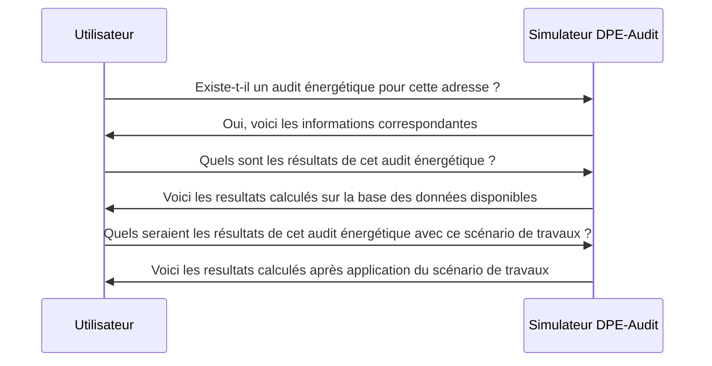

# @renolab/audit-api

API 

## Roadmap

### Domaine métier

- [x] Baie
- [x] Climatisation
- [x] Local non chauffé
- [x] ECS
- [x] Masque lointain
- [x] Masque proche
- [x] Mur
- [x] Photovoltaïque
- [x] Plancher haut
- [x] Plancher intermédaire
- [x] Pont Thermique
- [x] Porte
- [x] Refend
- [x] Réseau de chaleur
- [x] Ventilation

### Fonctionnalités

- [] Simulation d'un audit depuis un audit existant (observatoire DPE-Audit)
